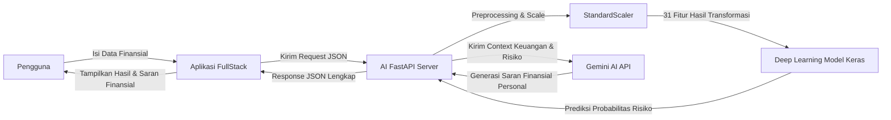

# 💳 FinCerdas - Sistem Pengelolaan Keuangan dan Prediksi Gagal Bayar untuk Meningkatkan Inklusi Keuangan Generasi Muda


**FinCerdas** adalah sebuah sistem berbasis kecerdasan buatan (AI) dan aplikasi modern untuk memprediksi serta mengelola risiko gagal bayar (*credit default*) kartu kredit nasabah secara cerdas. 

Proyek ini dibangun sebagai bagian dari Capstone Project dengan arsitektur monorepo yang terbagi ke dalam dua modul utama: **AI** (Backend API & Machine Learning) dan **FullStack** (Aplikasi Dashboard & Antarmuka Pengguna).

---

## 📁 Struktur Repositori

Repositori ini disusun secara modular untuk memisahkan logika kecerdasan buatan dengan aplikasi dashboard utama:

```text
FinCerdas-Capstone-Project/
├── AI/                 # Modul Machine Learning / Deep Learning & FastAPI (Backend AI)
│   ├── app.py          # FastAPI Server
│   ├── README.md       # Dokumentasi setup detail & spesifikasi API modul AI
│   └── ...             # Model TensorFlow, dataset, & pipeline preprocessing
├── FullStack/          # Modul Aplikasi Web Dashboard & Manajemen Pengguna
│   └── ...             # Kode program antarmuka dashboard utama (Frontend & Backend Client)
├── .gitignore          # File konfigurasi Git ignore global
└── README.md           # Dokumentasi utama seluruh proyek (File ini)
```

---

## Komponen 1: AI (Credit Default Prediction API)

Modul **AI** bertugas sebagai mesin prediksi risiko (*prediction engine*) berbasis **Deep Learning** yang dideploy sebagai layanan REST API mandiri.

- **Teknologi**: Python, FastAPI, TensorFlow/Keras, Scikit-Learn, Google GenAI SDK.
- **Fitur**:
  - Prediksi probabilitas gagal bayar nasabah secara *real-time* berbasis data transaksi 3 bulan terakhir.
  - Integrasi dengan **Gemini AI** (`gemini-2.0-flash`) untuk memberikan rekomendasi finansial personal secara asinkron.
  - Penanganan data imbalance menggunakan pembobotan kelas (*class weights*) pada fase training model.
- **Lokasi Kode & Panduan**: Untuk petunjuk instalasi, aktivasi virtual environment (`.venv`), konfigurasi API Key Gemini, dan cara menjalankan server prediksi **[AI/README.md]**.

---

## Komponen 2: FullStack (Aplikasi Dashboard)

Modul **FullStack** bertindak sebagai antarmuka pengguna (dashboard manajemen) yang memfasilitasi staf perbankan atau nasabah untuk melihat profil kredit, menginput data transaksi, dan memantau hasil analisis risiko gagal bayar serta saran finansial dari sistem.

- **Teknologi**: Javascript/HTML/CSS (Web Framework modern).
- **Fitur**:
  - Formulir input interaktif profil dan riwayat transaksi nasabah.
  - Tampilan visual tingkat risiko (*risk level*) dengan indikator warna (Rendah, Sedang, Tinggi).
  - Panel rekomendasi finansial dari Gemini AI terstruktur (Prioritas, Penting, Jangka Panjang).

---

## Panduan Awal Memulai Proyek

Untuk memulai pengembangan atau menjalankan proyek ini di komputer lokal Anda:

1. **Kloning Repositori**:
   ```bash
   git clone <url-repositori-fincerdas>
   cd FinCerdas-Capstone-Project
   ```

2. **Jalankan Backend AI**:
   Masuk ke folder `AI`, siapkan environment variable `.env`, buat virtual environment, lalu jalankan FastAPI:
   ```bash
   cd AI
   # Detail instalasi lengkap ada di AI/README.md
   ```

3. **Jalankan Aplikasi Dashboard**:
   Masuk ke folder `FullStack` dan ikuti panduan instalasi spesifik di dalam folder tersebut untuk menjalankan aplikasi client/dashboard.
   ```bash
   cd ../FullStack
   ```

---

## 🤝 Alur Integrasi Sistem



Sistem dirancang agar berinteraksi secara asinkron dengan integrasi erat antara model Deep Learning lokal (untuk kecepatan dan efisiensi komputasi klasifikasi risiko) dan model Gemini AI LLM (untuk fleksibilitas penyusunan bahasa saran finansial yang personal).
